## Escuela Colombiana de Ingeniería

## Arquitecturas de Software

#### AUTORES:
- [Saray Alieth Mendivelso](https://github.com/saraygonm)
<<<<<<< HEAD
=======

>>>>>>> a901ec0e3d2a4e622edce6de35ee6290e700cf0d

# Componentes y conectores - Parte I.

El ejercicio se debe traer terminado para el siguiente laboratorio (Parte II).

#### Middleware- gestión de planos.

## Antes de hacer este ejercicio, realice [el ejercicio introductorio al manejo de Spring y la configuración basada en anotaciones](https://github.com/ARSW-ECI/Spring_LightweightCont_Annotation-DI_Example).

- [Link del repositorio solucionado.](https://github.com/saraygonm/LAB04.2-ARSW.git)

En este ejercicio se va a construír un modelo de clases para la capa lógica de una aplicación que permita gestionar planos arquitectónicos de una prestigiosa compañia de diseño. 

1. Configure la aplicación para que funcione bajo un esquema de inyección de dependencias, tal como se muestra en el diagrama anterior.

Definiciones de las etiquetas
- `@Autowired` le dice a Spring que debe "inyectar" o "proveer" automáticamente un objeto cuando se necesita.
  En términos más simples es un asistente que trae la herramienta correcta cuando le dicimos que lo que necesitamos.
- `@Service` marca una clase como un "servicio" dentro de la aplicación. Es una manera de decirle al Spring, "Esta clase hace trabajo de
  servicio y debe ser gestionada por el contenedor de Spring.
- `@Qualifier` en Spring sirve para decirle al sistema cuál versión de un objeto usar cuando hay varias opciones disponibles.
- Esto ayuda a evitar que se confunda al momento de "inyectar" esa dependencia.

	Lo anterior requiere:

	* Agregar las dependencias de Spring. //dependencia es simplemente un objeto que una clase necesita para funcionar
	* Agregar la configuración de Spring. //conjunto de instrucciones y definiciones que le dicen a Spring cómo crear, configurar y gestionar los objetos (beans) de la app. mediante archivos XML
	* Configurar la aplicación -mediante anotaciones- para que el esquema de persistencia sea inyectado al momento de ser creado el bean 'BlueprintServices'.

1) Agregamos la etiqueta `@Service` a la clase `InMemoryBlueprintPersistence`

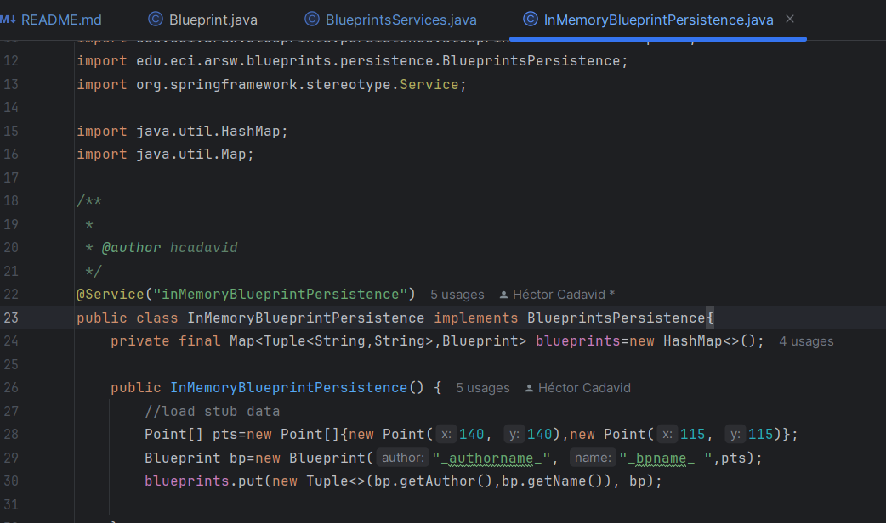

2) utilizando las etiquetas `@Autowired` y `@Qualifier`, indicamos que la clase `BlueprintServices` haga referencia a `InMemoryBlueprintPersistence`.

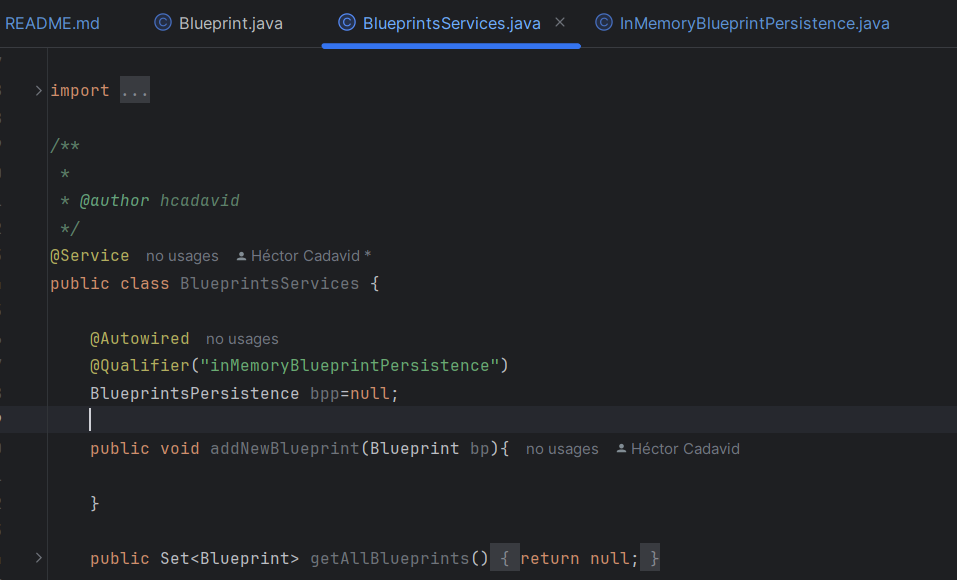

2. Complete las operaciones getBluePrint() y getBlueprintsByAuthor(). Implemente todo lo requerido de las capas inferiores (por ahora, el esquema de persistencia disponible 'InMemoryBlueprintPersistence') agregando las pruebas correspondientes en 'InMemoryPersistenceTest'.
   
- Se completa el método `getBlueprintsByAuthor()` en la clase `InMemoryBlueprintPersistence.java` el método busca en un conjunto de Blueprints todos aquellos que están asociados con un
autor específico y los devuelve en un conjunto. Siendo útil cuando se necesite filtrar y obtener solo los Blueprints relacionados con un autor dado.

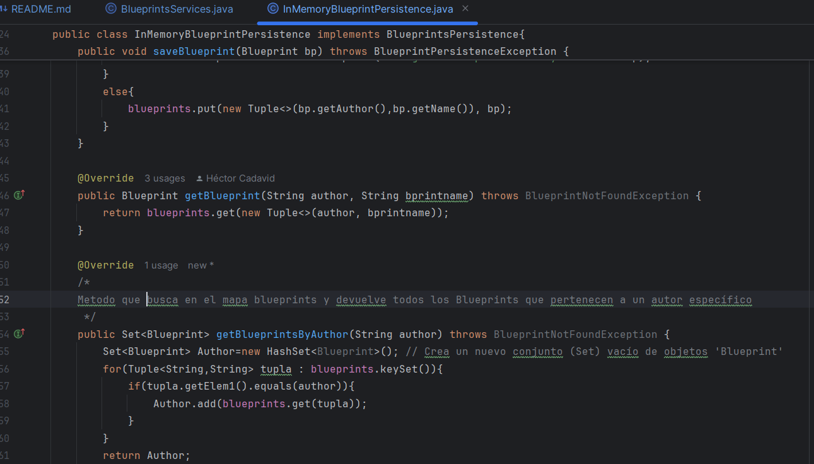

 - Estos métodos, en conjunto, proporcionan la funcionalidad para buscar y recuperar Blueprints basados en criterios de autor y nombre, apoyando 
la gestión de una colección de Blueprints en el sistema.

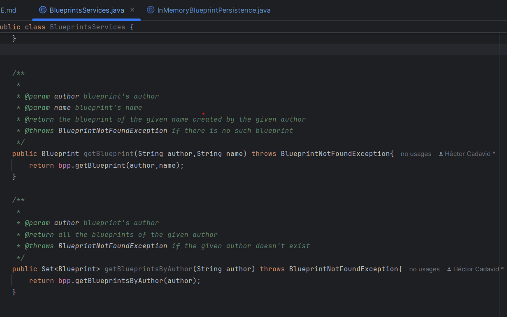

- Pruebas correspondientes en 'InMemoryPersistenceTest' para verificar que el metodo crado funcione bien

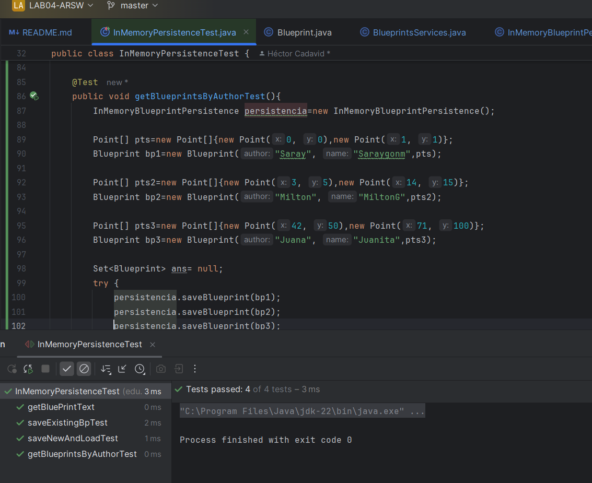

3. Haga un programa en el que cree (mediante Spring) una instancia de BlueprintServices, y rectifique la funcionalidad del mismo: registrar planos, consultar planos, registrar planos específicos, etc.

-Se creó la clase `main` para validar las funcionalidades de la aplicación. Esta clase:

1) Inicializa el Contexto de Spring: Carga el archivo applicationContext.xml.
2)  Servicios: Instancia el servicio BlueprintsServices.
3) Define y Registra Planos: Crea varios planos y los registra en el sistema.
4) Consulta y Muestra Planos: Realiza consultas para mostrar planos, uno específico y por autor.
5) Aplica Filtros: Muestra un plano y sus puntos originales y filtrados.

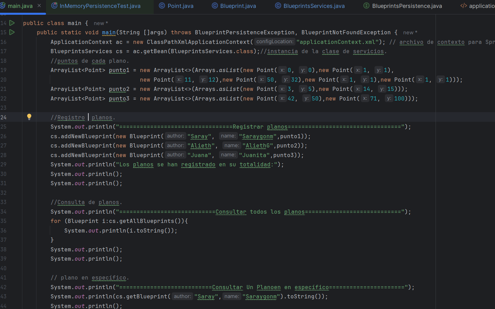

- En la salida primeramente se observa un mensaje de INFO:indican que la aplicación Spring está arrancando correctamente. Estos mensajes informan sobre la fecha y hora del arranque, así como la carga de los "bean definitions" desde el archivo applicationContext.xml.

## Registro de planos:
El sistema muestra que se han registrado varios "planos". Cada plano parece estar asociado a un autor y un nombre, por ejemplo:

- `Blueprint{author=Juana, name=Juanita}`
- `Blueprint{author=Alieth, name=AliethG}`
- `Blueprint{author=Saray, name=Saraygom}`

Estos son los planos que están registrados en la aplicación.

### Consultas de planos:

### Consultar todos los planos:
En esta parte se muestran todos los planos que se han registrado, junto con su autor y nombre.

### Consultar un plano en específico:
Aquí se consulta un plano específico por nombre o autor. Por ejemplo, se muestra el plano de la autora Saray con el nombre `Saraygom`.

### Consultar un plano específico por autor:
Esta consulta busca un plano dado el nombre del autor, como `Blueprint{author=Alieth, name=AliethG}`.

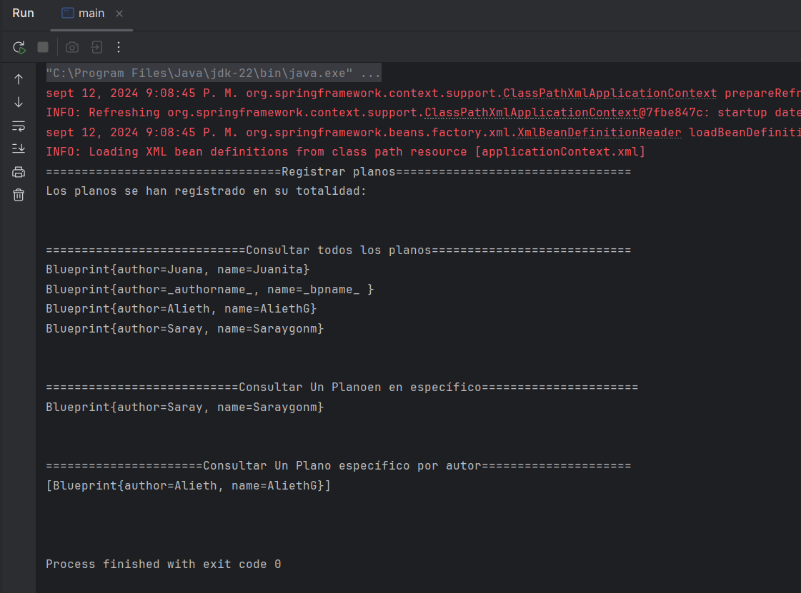

4. Se quiere que las operaciones de consulta de planos realicen un proceso de filtrado, antes de retornar los planos consultados. Dichos filtros lo que buscan es reducir el tamaño de los planos, removiendo datos redundantes o simplemente submuestrando, antes de retornarlos. Ajuste la aplicación (agregando las abstracciones e implementaciones que considere) para que a la clase BlueprintServices se le inyecte uno de dos posibles 'filtros' (o eventuales futuros filtros). No se contempla el uso de más de uno a la vez:
	* (A) Filtrado de redundancias: suprime del plano los puntos consecutivos que sean repetidos.
	* (B) Filtrado de submuestreo: suprime 1 de cada 2 puntos del plano, de manera intercalada.

### Aplicación del filtro:
Se muestra un listado de puntos (coordenadas X, Y) asociados a un plano, posiblemente relacionados con algún tipo de gráfico o estructura geométrica. Luego se aplica un "filtro de redundancia", que elimina puntos repetidos. El resultado después de aplicar este filtro muestra una lista de puntos filtrados:

- **Puntos originales**: Varios puntos con coordenadas `(x, y)` antes de aplicar el filtro.
- **Puntos filtrados**: Muestra los puntos que permanecen tras eliminar duplicados.

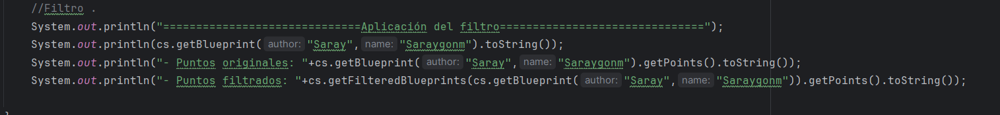

### Sálida:

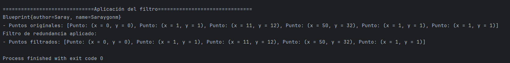

5. Agrege las pruebas correspondientes a cada uno de estos filtros, y pruebe su funcionamiento en el programa de prueba, comprobando que sólo cambiando la posición de las anotaciones -sin cambiar nada más-, el programa retorne los planos filtrados de la manera (A) o de la manera (B). 
Para llevar a cabo los filtros agregamnos las siguientes etiquetas en la clase `BluePrintServices`

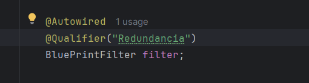

- **Compilación exitosa**: Tanto el código principal como las pruebas han sido compilados sin errores, aunque hay advertencias sobre la versión de Java.
- **Dependencias descargadas**: Maven descargó correctamente las dependencias necesarias para ejecutar las pruebas, como JUnit.
- **No se muestran fallos**: No hay mensajes indicando que alguna prueba haya fallado o que el proceso de pruebas haya arrojado errores.

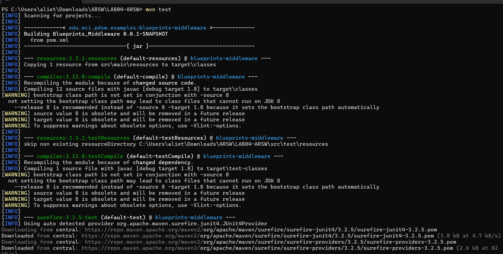

